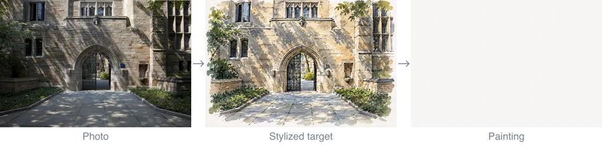
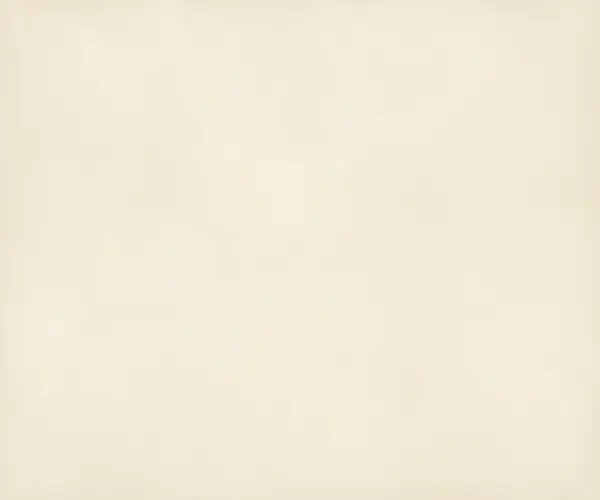
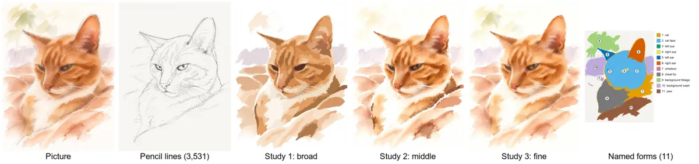
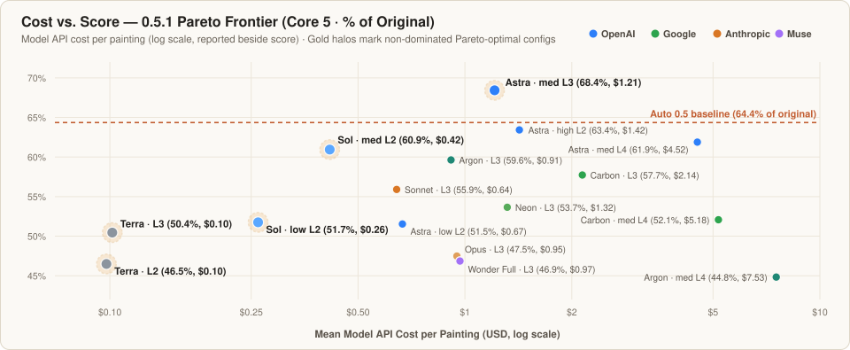

# Unpainting: It's All a Pigment of Your Imagination

`unpainting` is a Node.js watercolor and ink simulator. It paints an input image one brushstroke at a time. It specializes in the rather obscure and somewhat useless goal of making incomplete paintings.

* It does not use a black-box neural net or pixel-by-pixel hill climbing... to actually implement the brushstrokes.[^nn]
* It combines watercolor physics with planning and execution tools for large language models (LLMs) to make transparent paintings. Models with vision and reasoning do best. This is not efficient!!!
* You can stop or rewind a painting at any point between blank page and finished product. At every point it should look as if a human painted it, in the painting behavior as well as the pixels. In theory.
* It doesn't actually make the painting! It only unmakes them, so you can't start with a photo. It will almost always make something worse than where you started, but it's about the journey.
* It is designed so that you can run it and its associated benchmarks locally (or with cheap open source model calls to help if needed)

<p align="center"></p>

<p align="center">Yale Rosewalk.</p>

Try the [quick start](#try-it), paint by hand in [Paint Lab](https://sabj.github.io/unpainting/demos/lab/), watch mushrooms paint themselves in [Spore Studies](https://sabj.github.io/unpainting/demos/fungi/), or take a painting apart [layer by layer](https://sabj.github.io/unpainting/demos/layers/). This is just a side experiment, so caveat emptor. And apologies for some Git repo slop, stale claims, or weird overfittings -- this is 99.9% AI code and 99% AI documentation so, you know, good luck.

## Why model paint drying

<p align="center">Why not.</p>

<div align="center">

<table>
<tr>
<td align="center" width="25%"><a href="https://sabj.github.io/unpainting/demos/lab/"><br>Paint Lab, to try it</a></td>
<td align="center" width="25%"><a href="https://samjackson.org/writing/whats-a-painting-anyway-part-1/"><br>Blog post on the motivations</a></td>
<td align="center" width="25%"><a href="docs/reading-list.md"><br>Literature review, to see more</a></td>
<td align="center" width="25%"><a href="https://sabj.github.io/unpainting/demos/"><br>More demos</a></td>
</tr>
</table>

</div>

## How it works

Auto, the built-in painter, works from a line drawing and simplified colour studies. An image model makes the studies, from broad shapes to fine detail. Code traces the drawing and orders the lines. Auto draws them, then builds up thin washes from light to dark. A model can also write its own script and start on blank paper.

<p align="center"><a href="docs/how-it-paints.md"></a></p>

While a painting runs, a guard stops the code from reading the target's pixels: [how it paints](docs/how-it-paints.md), [the guard](docs/honesty.md).

<p align="center"></p>

## Try it

Start with a picture already in watercolor or ink-and-wash style. A photo gives poor results. Requires [Node.js](https://nodejs.org/en/download) 25 or later.

```sh
git clone https://github.com/sabj/unpainting.git
cd unpainting
npm ci
npm run quick-start
```

Open `work/plan-graded-wash/result.png`: a blue wash fading from dark to light, in about five seconds. Then the bundled public-domain examples:

```sh
npm run example:animal      # Tiepolo, Punchinello Riding a Camel: a drawing and one simplified picture
npm run example:portrait    # Sargent, A Tramp: one simplified picture, no drawing
```

<p align="center"></p>

[Getting started](docs/running.md) covers your own image, the benchmark's pictures and model painters. `ffmpeg` is needed for MP4 videos (`--video 0` skips them). Python 3 is needed for tracing a drawing, finding regions and scoring.

`npm run unpaint` is one command for painting, benchmark runs, cloud GPUs and scoring ([benchmark](bench/README.md#run-it)):

```sh
npm run unpaint -- --help
npm run unpaint -- paint mittens-closeup-qs plan              # plan or paint a prepared benchmark picture
npm run unpaint -- benchmark --out work/bench-05 --set core   # lists every session; --start runs them
npm run unpaint -- status work/bench-05                       # progress of the runs
```

## Benchmark

[unpaint-bench](bench/README.md) hands AI models the simulator's brush and pen across **15 pictures** (5 Core at `L1–L4`, 10 Extended at `L2`; [credits](bench/PICTURES.md)). Models can look at the target, never read its pixels, and are graded by two open-weight vision judges (`open2`: **Qwen 3.8 27B + Gemma 4 31B**, identical locally on Apple Silicon MLX or via OpenRouter) on craft vs Auto 0.5 and human-ness across ten progress frames (`Q × min(1, H / 65)`).

| Level | Inputs given to the model | Mode |
|---|---|---|
| **L1** | Source picture + script format | Fixed rounds |
| **L2** | L1 + three colour block-in studies | Fixed rounds |
| **L3** | L2 + opt-in drawing, named forms, traced shapes, Auto plan | Fixed rounds |
| **L4** | Same inputs as L3 | Isolated shell (`python3` + `./unpaint`) |

<p align="center"><a href="docs/what-the-model-gets.md"></a></p>

<p align="center"><a href="bench/README.md"></a></p>

<p align="center"><a href="bench/README.md"></a></p>

<p align="center"><a href="bench/README.md"></a></p>

Full tables, findings, and setup: [unpaint-bench](bench/README.md) · [what the model gets](docs/what-the-model-gets.md) · [rules](bench/docs/rules.md) · [scoring](bench/docs/scoring.md) · [changelog](CHANGELOG.md). Older V1–V5 rounds: [leaderboard](bench/results/leaderboard.md), [gallery](bench/results/gallery.md) (tag `v0.3.2`).

## References and license

- [The essay about how this was built](https://samjackson.org/writing/whats-a-painting-anyway-part-1/)
- [Reading list](docs/reading-list.md)
- [Contributing](CONTRIBUTING.md)
- Code: MIT ([LICENSE](LICENSE)). Painter output from public-domain inputs: CC BY 4.0. Bundled photos and third-party credits: [NOTICE](NOTICE) and [THIRD_PARTY_NOTICES.md](THIRD_PARTY_NOTICES.md).

[^nn]: Pretrained models are used only before painting starts: image models make the line drawing and block-in studies, and SAM finds regions in the target ([reading list](docs/reading-list.md)).
